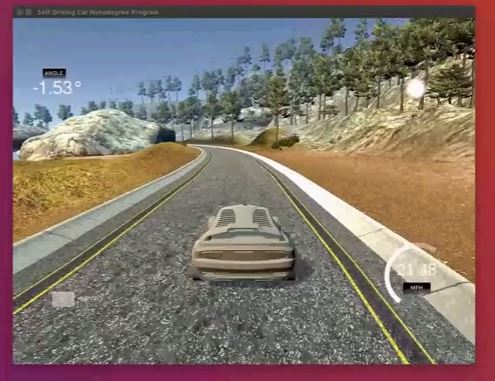

# Car Behavioral Cloning using Pytorch

## This is a work in progress

## Overview

I create this project after watching Siraj's video about how to simulate a self-driving car.
Instead using Keras to build a model, I want to using Pytorch for the model and training.

The repo is inspired by [naokishibuya](https://github.com/naokishibuya). I adapt his augmentation methods.

## Video demo: 
[](https://youtu.be/nJcglRrftaY)

## Challenges:

- I think the most challenge is generating enough data for your model. For some tricky curves on the road, you need to creat more data.
- Building a model in Pytorch is not as straighforward as in Keras. You need to understand the framework and how it processes data first.
- Need to create a Dataloader for your own data.
- Re-use as much code as possible.

## What has been done so far

- Created the Dataloader for car dataset
- Created the CarModel for training with the dataset. The model is based on The [NVIDIA model](https://devblogs.nvidia.com/parallelforall/deep-learning-self-driving-cars/).
- Created another Simple Car Model by reducing the number of Convolutional and Linear layers.
- Modified drive.py so that it can load the Pytorch model.
- After training Simple Model  around 15 epochs, the model can drive a car for one full lap without any crashing. 
- I save two model, the first model is saved when the validation loss is lowest, the second model is saved after training phase stop. As I notice, the second model is quite smoother than the first one.
- Working models are put inside ```working_models``` dir

## Model summary:
```python
  (module): CarSimpleModel (
    (conv_layers): Sequential (
      (0): Conv2d(3, 24, kernel_size=(3, 3), stride=(2, 2), bias=False)
      (1): ELU (alpha=1.0)
      (2): Conv2d(24, 48, kernel_size=(3, 3), stride=(2, 2), bias=False)
      (3): MaxPool2d (size=(4, 4), stride=(4, 4), dilation=(1, 1))
      (4): Dropout (p = 0.25)
    )
    (linear_layers): Sequential (
      (0): Linear (3648 -> 50)
      (1): ELU (alpha=1.0)
      (2): Linear (50 -> 10)
      (3): Linear (10 -> 1)
    )
```  

## Notes

- Training the neural network


- After trained, the network is able to generate steering commands from the video images of a single center camera.


- Testing the model with the Simulator


## Dependencies

- You can install all dependencies by running conda:

```bash
conda env create -f environments.yml
```
- Note: I've removed tensorflow in this file
- After that, you need to install [Pytorch](pytorch.org)
- To run up the server, you need to download [Udacity Self-Driving Car Simulator](https://github.com/udacity/self-driving-car-sim). (using Autonomous Mode when trying your model)
